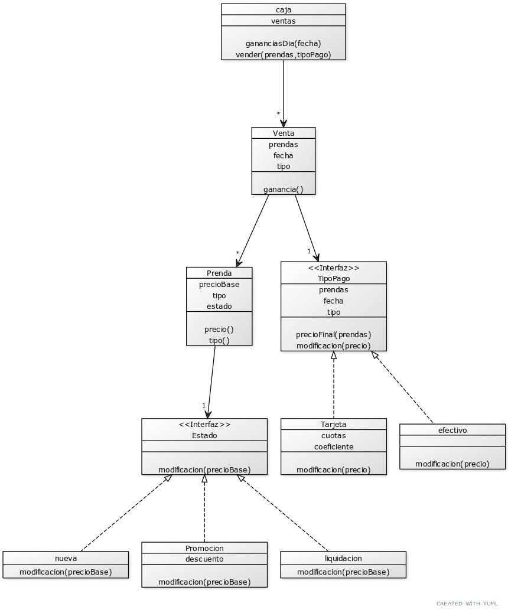

# Macowins
### Diagrama de clases

### Requisitos
- Registrar una venta
- Consultar ganancias diarias
- Consultar precio y tipo de prenda
### Justificaciones
#### Tipos de prenda como strings
Podrian haber sido objetos, pero al no tener ninguna otra reposonsabilidad no me parecia que mostrar un texto lo justifijase.
#### Estado de prenda por composicion
Todavia no es un problema, pero con herencia podria terminar teniendo que hacer combinaciones.
#### tipo de pago con composicion
Esto es porque me facilitaba contruir el objeto venta (cuando se realiza la venta en caja).
